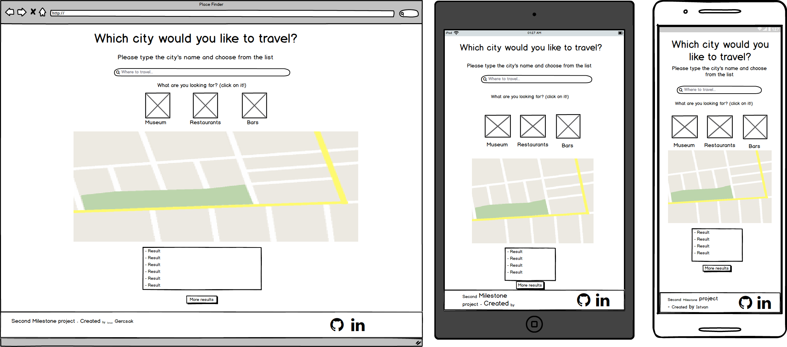

# Place Finder - Second Milestone Project
READY

This website was made as my second Milestone project at [Code Institute](https://codeinstitute.net/).
The main goal was to create frontend-only website using the technologies that I learned in the second phase and heavily based on JavaScript and its jQuery library and also on Google API libraries.
The application itself help to us to find cities around the world and we get back a list from Museums, Restaurants and Bars around that area.
Moreover we can see those places position on the Map with Markers to find them and plan holiday more easily around that area.
The site is a single page website therefore very simple and easy to use and don't need any special technical skills to use it.  
After we give a destination there is only one click and we get back results. It is also easy to use with one hand when we check it on our phones.

## UX
READY

This website is created for everybody who want to use it to find a good holiday destinations.
I used bright colors and background to ensure that this site has a user friendly and smooth surface.
The website is responsive so it can be used also on PC, Tabled or on mobile device with the same functionality respectively.
- Input type:
    - type=search, so in this way it became more straightforward and user friendly.
- Font:
    - I use Nunito font, because it is easy and comfortable to read. I imported that font through the .css style file from the google fonts repository.
- Icons:
    - I use Font Awesome icon toolkit for the search filter section(Museum, Restaurant, Bar) and the social link icons.#
- Hover effects:
    - Filter section
        - Museum
        - Restaurant
        - Bar
    - Social links
        - Github
        - LinkedIn
- Smooth movement to the map after choose the filter
- Favicon (Shortcut icon) with "pinpoint" sign on the page.

**Created with [Balsamiq Mockups 3](https://balsamiq.com/) that is a user interface design tool**

- **Home page**:

##User Stories
TODO

## Features
TODO
In this section, you should go over the different parts of your project, and describe each in a sentence or so.
 
### Existing Features

- Feature 1 - allows users X to achieve Y, by having them fill out Z
- ...

For some/all of your features, you may choose to reference the specific project files that implement them, although this is entirely optional.

In addition, you may also use this section to discuss plans for additional features to be implemented in the future:

### Features Left to Implement
TODO
- Another feature idea

## Technologies Used
READY

- [HTML5](https://www.w3.org/html/)
    - Hypertext Markup Language is the standard markup language for creating web pages and web applications.
- [CSS3](https://www.w3.org/Style/CSS/)
    - Cascading Style Sheets is a style sheet language used for describing the presentation of a document written in a 
    markup language like HTML.
- [BootStrap 4.3.1](https://getbootstrap.com/docs/3.3/)
    - Front End Framework for developing responsive websites.
- [JavaScript](https://developer.mozilla.org/en-US/docs/Web/JavaScript)
    - JavaScript is a lightweight interpreted or just-in-time compiled programming language with first-class functions. While it is most well-known as the scripting language for Web pages.
- [JQuery 3.4.1](https://jquery.com)
    - The project uses to simplify DOM manipulation.
- [Git](https://git-scm.com/)
    - Git is a distributed version-control system for tracking changes in source code during software development.
- [GitHub](https://github.com/)
    -  GitHub Inc. is a web-based hosting service for version control using Git.
- [Google Maps JavaScript API](https://developers.google.com/maps/documentation/javascript/tutorial)
    - The Maps JavaScript API lets you customize maps with your own content.
    - Library used:
        - Google Places API

## Testing
TODO

In this section, you need to convince the assessor that you have conducted enough testing to legitimately believe that the site works well. Essentially, in this part you will want to go over all of your user stories from the UX section and ensure that they all work as intended, with the project providing an easy and straightforward way for the users to achieve their goals.

Whenever it is feasible, prefer to automate your tests, and if you've done so, provide a brief explanation of your approach, link to the test file(s) and explain how to run them.

For any scenarios that have not been automated, test the user stories manually and provide as much detail as is relevant. A particularly useful form for describing your testing process is via scenarios, such as:

1. Contact form:
    1. Go to the "Contact Us" page
    2. Try to submit the empty form and verify that an error message about the required fields appears
    3. Try to submit the form with an invalid email address and verify that a relevant error message appears
    4. Try to submit the form with all inputs valid and verify that a success message appears.

In addition, you should mention in this section how your project looks and works on different browsers and screen sizes.

You should also mention in this section any interesting bugs or problems you discovered during your testing, even if you haven't addressed them yet.

If this section grows too long, you may want to split it off into a separate file and link to it from here.

## Deployment
READY

- **Set up**:
    - I use local IDE for create the project, I installed the Git locally and synchronized my local IDE 
    with the local git. I use IntelliJ Pycharm for the front end development with its helpful built in deployment tools. 
    After I created a Git and GitHub repository, I could start to work and I could test my features locally.
- **Commits**:
    - After every small piece and increment, I made commit to my local Git repository. After that in the end of the 
    bigger section that gives value to my project I pushed my modification to my GitHub repository.

### Media
READY

- The photos used in this site were obtained from:

    - Favicon:

        - http://dreammaker.co.in/images/map-marker3.png

    - Wallpaper:

        - https://wallpapershome.com/travel/fuji-japan-travel-tourism-national-geographic-traveler-10326.html?page=222