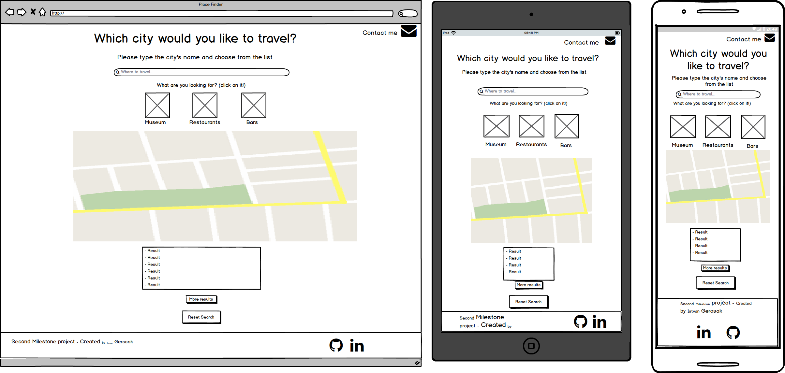
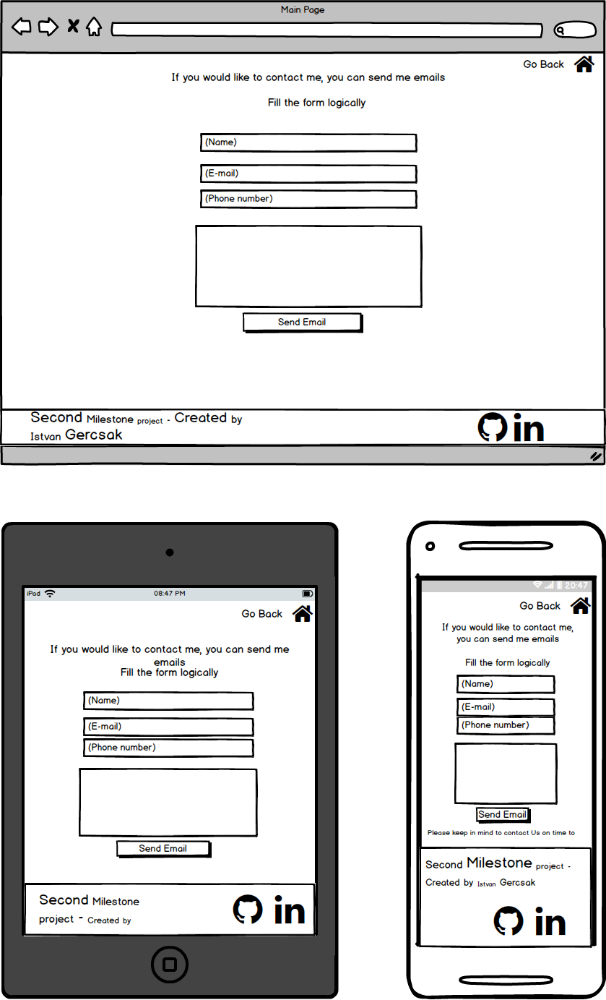

# Place Finder - Second Milestone Project
[View my project](https://istvangercsak.github.io/PlaceFinder-SecondMilestoneProject/)

This website was made as my second Milestone project at [Code Institute](https://codeinstitute.net/).
The main goal was to create a simple website which is using the technologies that I learned in the second phase and heavily based on JavaScript and its jQuery library and also on Google API libraries.
The website itself help to us to find cities around the world and we get back a list of Museums, Restaurants and Bars around that area.
Moreover we can see those places position on the Map with Markers to find them and plan holiday more easily around that area.
The site is a single page website therefore very simple and easy to use and don't need any special technical skills to use it.  
After we give a destination there is only one click and we get back results. It is also easy to use with one hand when we check it on our phones.
There is another page called contact page with working email sending function. Hence if somebody want to contact me it is possible to do it.
At the same time the sender will get an automatic reply as well as a feedback and here we can check the correctness of the given personal details.

## UX

This website is created for everybody who want to use it to find a good holiday destinations.
I used bright colors and background to ensure that this site has a user friendly and smooth surface.
The website is responsive so it can be used also on PC, Tablet or mobile device with the same functionality respectively.

## UI

- In General:
    - Font:
        - I use "Nunito" font, because it is easy and comfortable to read. I imported that font through the .css style file from the google fonts repository.
    - Icons:
        - I use Font Awesome icon toolkit with the below mentioned icons: 
            - Museum
            - Restaurant
            - Bar
            - Reset button
            - Mail
            - GitHub
            - LinkedIn 
            - Home
    - Hover effects:
        - Filter section:
            - Museum icon
            - Restaurant icon
            - Bar icon
        - Social links:
            - Github icon
            - LinkedIn icon
        - Envelop icon
        - Home Icon
        - Send Email button
    - Favicon (Shortcut icon) with "pinpoint" sign on the page.
- On the Place Finder page I have implemented:
    - Input type:
        - "type=search", so in this way it became more straightforward and user friendly to type in the destinations.
    - Smooth movement to the map after choose the filter
    - Alert message is the search input field is empty
- On the Contact page I have implemented:
    - Input fields:
        - Every fields are required
        - Every field has appropriate format:
            - Name: "type=text"
            - Phone: "type=tel"
            - Email: "type=email"
            - Description: "Text area"
    - Set up and working EmailJS function.
    - Hover on the send message
    - Alert message to notify the user whether the the message was sent or not
    
- Mockup

    - **Created with [Balsamiq Mockups 3](https://balsamiq.com/) that is a user interface design tool**

    - **Place Finder page**:
    
    - **Contact page**:
    

## User Stories

### Place Finder Page

- As a user, I want to get feedback if the searching field is empty
- As a user, I want to find cities for holiday destinations
- As a user, I want to find museums around the searched city
- As a user, I want to find restaurants around the searched city
- As a user, I want to find bars around the searched city
- As a user, I want to see the other opportunity around the city without type the city again
- As a user, I want to see more result if there are more
- As a user, I want to reset my search

### Contact Page

- As a user, I want to send a message to the creator of the site.
- As a user, I want to receive an auto-generated message from the creator of the site with my given details.
- As a user, I want to get feedback whether I fill the fields in wrong type.
- As a user, I want to get feedback whether I miss a one of the required field.
- As a user, I want to get feedback whether the message is sent or not.

### Responsive:

- As a user, I want to use the website on Pc, Tablet and Mobile Phone so that on different devices it will work with the same functionality.

### Effects:

- As a user I want to see the hover effects on the icons so that I can see there is interaction wih those elements.

### Social links:

- As a user, I want click on the social links so that it can be open in a new tab.

### Navigation

- As a user, I want to navigate between the Place Finder page and the Contact page with the given Envelop and Home icon.

## Features

With this page you can find a museums, restaurants and bars around that area that you give in the search field.
If you finished you search you can reset the process with clicking on the reset button.
The contact site and the email sending functionality is up and running, so I will get the message, and the sender will get a copy of their details.
 
### Existing Features

- In General:
    - Navigation:
        - Between PlaceFinder page (with Message icon) and the Contact page (with Home icon)
- Responsive:
    - The page is responsive, usable and looks good on the below resolution:
        - Phones less than 768px
        - Tablets 768px and Up
        - Desktops 992ox and Up
        - Large desktops 1200px and Up

- Place Finder page
    - Field checking:
        - If the input search field is empty and I click on one of the filter button, I get alert an alert message about that empty field
    - Icons:
        - To click on the Museum icon you get back museums around the given city
        - To click on the Restaurant icon you get back restaurants around the given city
        - To click on the Bar icon you get back bars around the given city 
    - Button:    
        - If in the first round we find more than 20 places the "More result" button become active 
        - If there are no more result, the "More result" button become disabled
        - If there is no result around the area at all the "More result" button become disabled
        - I can reset the search with the reset button
- Contact page:
    - Field checking (Every field is required)
    - Email sending functionality
    - Feedback with alert message about the sent email
        
## Technologies Used

- [HTML5](https://www.w3.org/html/)
    - Hypertext Markup Language is the standard markup language for creating web pages and web applications.
- [CSS3](https://www.w3.org/Style/CSS/)
    - Cascading Style Sheets is a style sheet language used for describing the presentation of a document written in a 
    markup language like HTML.
- [BootStrap 4.3.1](https://getbootstrap.com/docs/3.3/)
    - Front End Framework for developing responsive websites.
- [JavaScript](https://developer.mozilla.org/en-US/docs/Web/JavaScript)
    - JavaScript is a lightweight interpreted or just-in-time compiled programming language with first-class functions. While it is most well-known as the scripting language for Web pages.
- [JQuery 3.4.1](https://jquery.com)
    - The project uses to simplify DOM manipulation.
- [Git](https://git-scm.com/)
    - Git is a distributed version-control system for tracking changes in source code during software development.
- [GitHub](https://github.com/)
    -  GitHub Inc. is a web-based hosting service for version control using Git.
- [Google Maps JavaScript API](https://developers.google.com/maps/documentation/javascript/tutorial)
    - The Maps JavaScript API lets you customize maps with your own content.
    - Library used:
        - Google Places API
- [EmailJS](https://www.emailjs.com/)
    - EmailJS helps sending emails using client side technologies only

## Testing

You can find the testing document in the [Testing.md](https://github.com/IstvanGercsak/PlaceFinder-SecondMilestoneProject/blob/master/Testing.md) file.

## Deployment

How I implement this project:

Firstly I built the basic functionality one of my private repository until I get the first working version of website. 
After this I copied the code snippets in this public repository, and explained the actual small pieces of the commits in the commit comment section.
- Lesson learned: For the next project I should use the branching function and separate the dev and prod branches.

- **Set up**:
    - I use local IDE for create the project, I installed the Git locally and synchronized my local IDE 
    with the local git. I use IntelliJ Pycharm for the front end development with its helpful built in deployment tools. 
    After I created a Git and GitHub repository, I could start to work and I could test my features locally.
    I could see my changes locally to open my index.html file with the View/Open browser menu option in my local IDE.
    Here I could choose the required browser which I want to use. (Chrome, Mozilla, etc.)
- **Commits**:
    - After every small piece and increment, I made commit to my local Git repository. After that in the end of the 
    bigger section that gives value to my project I pushed my modification to my online GitHub repository.
    - For the development I only use one branch called "master".
- **Local and online deployment**
    - Locally: It is very easy to clone repository from my account if you follow these steps:
        1. Follow this link [Project GitHub repository](https://github.com/IstvanGercsak/PlaceFinder-SecondMilestoneProject) 
        2. Under the repository name, click "Clone or download".
        3. Here you have to copy the url's of the repository
        4. In your local IDE you can choose to create new project from version control/Git 
        5. Paste the link there that you copied before
        6. For additional help you can more information under this [link](https://help.github.com/en/articles/cloning-a-repository)
        
    - Online:
        - When there was a working increment after pushing it to my online GitHub repository I could test it online with real usage.
        For this I followed these steps:
            1. Under [my project GitHub directory](https://github.com/IstvanGercsak/PlaceFinder-SecondMilestoneProject) from the menu items I clicked on the Settings 
            2. Under the GitHub Pages section I could set up my online site from my master branch.
            3. After few minutes the online deployed site was available the given [link](https://istvangercsak.github.io/PlaceFinder-SecondMilestoneProject/)
          
### Media

- The photos used in this site were obtained from:
    - Favicon:
        - http://dreammaker.co.in/images/map-marker3.png
    - Wallpaper:
        - https://wallpapershome.com/travel/fuji-japan-travel-tourism-national-geographic-traveler-10326.html?page=222
